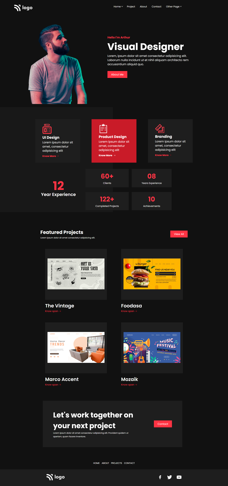

# Product Landing Page

`Author:` Padmanabh Belavadi

This is UI design Landing page of a Product Website this is fully designed using core `HTML` and `CSS`.
and this is responsive for mobile screens and laptop screens

## My Project Looks Like :

## Reach Me Out on

- 
- 

## Time Taken to finish this project

- I had taken 15 hour to complete this one

## Deployed Link
[Product Design Page](https://product-design-ui-page.netlify.app/)
